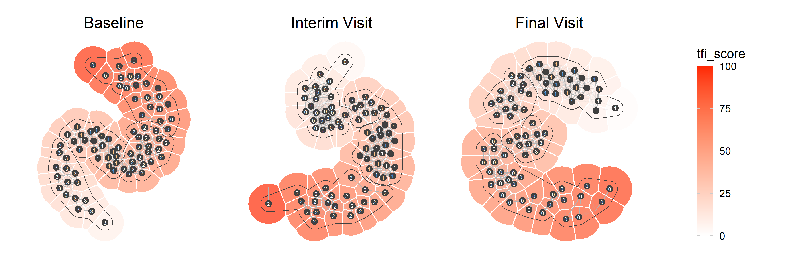

# community-viz

Visualizations of community detection graphs

**Berlin:**

**Regensburg:**

## Interactive versions

[Berlin](https://unmnn.github.io/community-viz/figures/berlin_tfi_score-b-iv-fv.html)  
[Regensburg](https://unmnn.github.io/community-viz/figures/regensburg_tfi_score-b-iv-fv.html)
